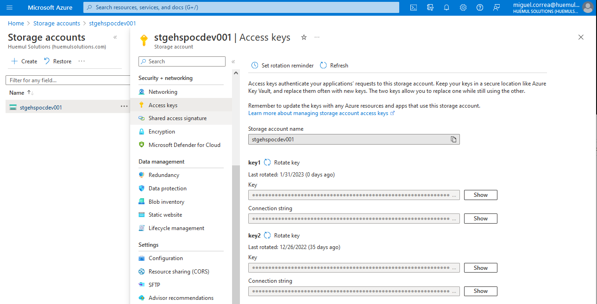

# Azure Blob Container - NodeJS Images Manager. 
Este es un gestor de imagenes almacenadas en un conteneder de Microsoft Azure.  
Sus funciones son subir y mostrar una imagen, además de listarlas todas en una vista de mosaico.  
Se usó NodeJS para crear 3 endpoints y se ejecutan las funciones de azure respectivas.  
Para más detalles, revisar la documentación en https://learn.microsoft.com/en-us/azure/storage/blobs/storage-quickstart-blobs-nodejs.

## Ejecución básica.
Instalas las dependencias indicadas en el archivo **package.json** con el comando **npm install**.  
Se debe correr en la terminal los comandos **node .** o **node app.js** para levantar el servidor.  
El servicio estará corriendo en el puerto indicado en el archivo **app.js**.  
Esto levantará el contenido del archivo **index.html**, el cual contiene un formulario para adjuntar y subir las imágenes.  
Los permisos de acceso se gestionan con la variable de entorno ubicada en el archivo **.env**, la cual es tomada por el archivo **config.js** e importada por **app.js** en las primeras líneas.  
Este modelo usa autenticación a través del uso de un **String Connection**, el cual se puede encontrar en el **Azure Storage Account**,  en el panel izquierdo, **Access Keys**. Luego a la derecha se ven los datos indicados. Se puede usar indistintamente la **key1** o la **key2**.   

